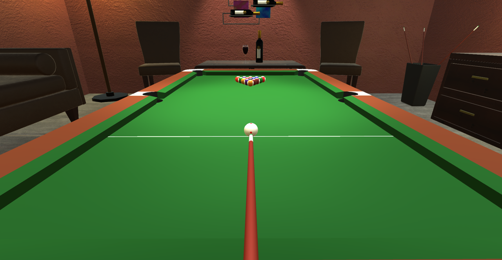

# Billiard
## 專案介紹
本專案使用 Unity 遊戲引擎配合 C# 程式語言開發一款花式撞球遊戲。

## 專案技術
Unity 2022.3.0、C# 9.0、Blender 4.0

## 遊戲操作
* 滑鼠左鍵：操控球桿在母球連線方向上的移動以及擊球
* 滑鼠右鍵：操控玩家視角以母球為中心旋轉
* 滑鼠滾輪：縮放玩家視角

## 成果

https://github.com/Yaowun/Billiard/assets/90306375/da7fd5c8-b8b9-4805-9079-a603b1940b12

https://github.com/Yaowun/Billiard/assets/90306375/a084e30d-e06a-4ea0-87c8-1d1a7c1a6f47
